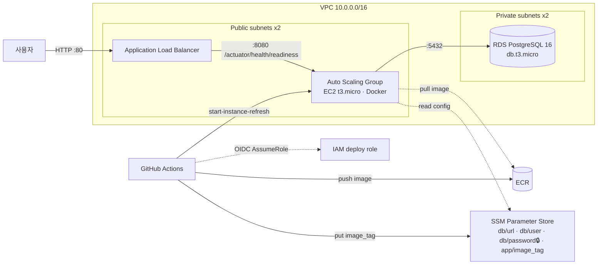

# spring-aws-starter

[](https://github.com/jungtaejin/spring-aws-starter/actions/workflows/ci.yml)


Spring Boot 서비스 하나를 **Terraform으로 AWS에 올리고, GitHub Actions로 무중단 배포**하는 최소 구성 템플릿입니다. 애플리케이션은 의도적으로 단순하고(아이템 CRUD + actuator), 핵심은 `infra/`와 `.github/workflows/`에 있습니다.

> 실무에서 EC2·VPC·ALB·CodePipeline·Lambda로 운영하던 구성을, 재현 가능하고 비용을 통제할 수 있는 형태로 코드화한 것입니다. 프리티어 범위에서 실행할 수 있고 `terraform destroy` 한 번으로 흔적 없이 지워집니다.

## 아키텍처



**배포 흐름**: `git tag v*` 또는 수동 실행 → 이미지 빌드·ECR 푸시 → SSM `app/image_tag` 갱신 → ASG 인스턴스 리프레시(롤링, 최소 50% 유지). 새 인스턴스는 부팅 시 SSM에서 설정을 읽고 컨테이너를 띄우며, ALB는 readiness 프로브가 200을 줄 때까지 트래픽을 보내지 않습니다.

## 설계 결정과 이유

| 결정 | 이유 |
|---|---|
| EC2를 **퍼블릭 서브넷**에 두고 SG로만 잠금 | NAT Gateway(월 약 $35)가 소규모 VPC에서 가장 큰 비용. 인바운드는 ALB SG만 허용하므로 노출 위험은 없음 |
| RDS는 **프라이빗 서브넷**, 인터넷 경로 없음 | DB는 밖으로 나갈 이유가 없음. app SG에서 5432만 허용 |
| **SSH 없음**, SSM Session Manager | 키 관리·22번 포트 제거. 인스턴스 역할에 `AmazonSSMManagedInstanceCore`만 붙임 |
| 설정은 **SSM Parameter Store**, 비밀번호는 SecureString | user-data·AMI·이미지에 비밀 없음. 배포는 파라미터 하나만 바꿈 |
| GitHub Actions는 **OIDC**로 역할 위임 | 장기 액세스 키를 GitHub Secrets에 두지 않음. 신뢰 정책이 `repo:jungtaejin/spring-aws-starter:*`로 한정 |
| 배포 = **인스턴스 리프레시** | 불변 인프라. 실패하면 새 인스턴스가 healthy가 못 되어 자동 중단, 기존 인스턴스는 유지 |
| AMI는 **SSM 공개 파라미터**로 해석 | 최신 AL2023을 항상 사용, AMI id 하드코딩 없음 |
| Flyway가 스키마 소유, `ddl-auto: none` | 로컬 H2(PostgreSQL 모드)와 RDS가 같은 마이그레이션을 실행 |
| IMDSv2 강제, 컨테이너 non-root 실행 | 기본 보안 위생 |

## 예상 비용 (ap-northeast-2, 1개월 상시 가동)

| 리소스 | 사양 | 프리티어 이후 월 비용 |
|---|---:|---:|
| EC2 | t3.micro × 1 | 약 $9 |
| RDS | db.t3.micro, 20GB gp3, 단일 AZ | 약 $15 |
| ALB | 1개 + 소량 LCU | 약 $18 |
| ECR / SSM / 데이터 전송 | 소량 | $1 미만 |
| **합계** | | **약 $43** |

12개월 프리티어 계정이면 EC2·RDS는 750시간/월 무료여서 ALB 비용만 남습니다. 실습 후에는 반드시 `terraform destroy`.

## 실행

### 0. 로컬에서 앱만

```bash
./gradlew test bootRun            # H2 in-memory, http://localhost:8080/api/items
curl -X POST localhost:8080/api/items -H 'content-type: application/json' -d '{"name":"first"}'
curl localhost:8080/actuator/health
```

### 1. 인프라 생성

```bash
cd infra
cp terraform.tfvars.example terraform.tfvars   # db_password 등 입력
terraform init
terraform plan
terraform apply                                # 약 10분 (RDS 생성 시간)
terraform output github_actions_role_arn       # → GitHub 저장소 Secrets에 AWS_ROLE_ARN 으로 저장
```

첫 apply 직후 인스턴스는 `latest` 태그 이미지를 찾지만 ECR이 비어 있어 컨테이너가 뜨지 않습니다. 정상입니다. 다음 단계에서 이미지를 넣으면 인스턴스 리프레시가 해결합니다.

### 2. 배포

```bash
git tag v0.1.0 && git push --tags              # 또는 Actions 탭에서 Deploy 워크플로 수동 실행
# 완료 후
curl http://$(terraform -chdir=infra output -raw alb_dns_name)/actuator/health
```

### 3. 정리

```bash
terraform -chdir=infra destroy
```

## 저장소 구조

```
src/                      Spring Boot 3.3 · Java 21 · JPA · Flyway · Actuator
  main/resources/db/migration/V1__create_item.sql
infra/                    Terraform (단일 루트 모듈)
  vpc.tf  security_groups.tf  alb.tf  ec2.tf  rds.tf  ecr.tf  ssm.tf  iam.tf
  user_data.sh.tpl        부팅 시 SSM에서 설정 읽고 컨테이너 실행
.github/workflows/
  ci.yml                  Gradle 테스트 → Docker 빌드·스모크 테스트 → terraform fmt/validate
  deploy.yml              OIDC → ECR 푸시 → SSM 갱신 → 인스턴스 리프레시
Dockerfile                멀티스테이지, JRE 21, non-root
```

## AWS SAA 시험 범위와의 대응

이 저장소를 손으로 한 번 올리고 내리면 다음 항목을 실제로 겪게 됩니다.

- 네트워크: VPC, 서브넷 티어링, IGW, 라우트 테이블, NAT 없이 설계하는 이유
- 컴퓨팅: Launch Template, ASG 인스턴스 리프레시, ALB 헬스체크·slow start·deregistration delay
- 데이터: RDS 서브넷 그룹, 암호화, Multi-AZ 비용 트레이드오프
- 보안: 3계층 SG 체인, IAM 최소 권한, OIDC 페더레이션, SSM SecureString + KMS `ViaService` 조건, IMDSv2
- 운영: SSM Session Manager, 파라미터 스토어 기반 설정 주입, 불변 배포

## 로드맵

- [ ] HTTPS: ACM 인증서 + 443 리스너 + 80→443 리다이렉트 (도메인 필요)
- [ ] CloudWatch 알람(5xx, UnHealthyHostCount) → SNS
- [ ] ASG 타깃 추적 스케일링 정책(CPU 60%)
- [ ] `terraform plan` 결과를 PR 코멘트로 남기는 워크플로
- [ ] ECS Fargate 버전을 브랜치로 비교 (비용·운영 차이 문서화)

## License

MIT
